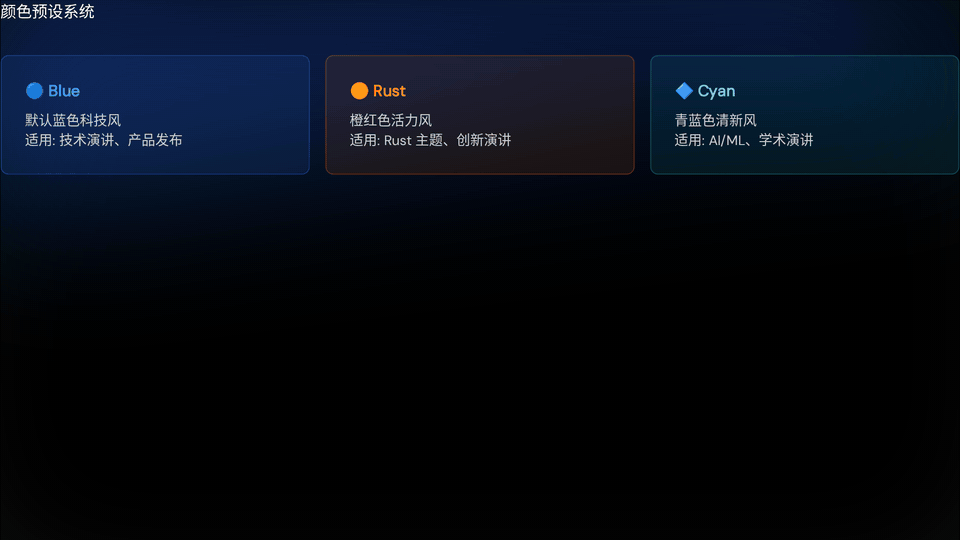

# slidev-templates

> 一个收录高质量 [Slidev](https://sli.dev) 演示模板的仓库，灵感来自 neko-talks 系列演讲。

## 📦 模板列表

| 模板 | 说明 | 预览 |
|------|------|------|
| [neko-style](./neko-style/) | 从 neko-talks / KubeCon HK 2025 演示文稿提取的专业技术演示风格 | 动态 Glow 背景、语义化配色、丰富组件库 |

## 🎬 Neko Style 实例 PPT 预览



> 若 GIF 在网络环境下加载较慢，可查看静态首屏预览：[`./assets/neko-style-preview.png`](./assets/neko-style-preview.png)

> 示例来源：`neko-style/example/slides.md`（用于展示 glow seed 背景效果）

## ✨ 特性概览

### neko-style

- 🌟 **动态 Glow 背景** — 基于多边形模糊渐变，每页独立配置，平滑过渡
- 🎨 **3 种颜色预设** — `blue`（科技蓝）、`rust`（橙红）、`cyan`（青蓝），支持深色 / 浅色主题
- 🃏 **语义化组件库** — 信息卡片、问题对比卡片、指标展示卡片，开箱即用
- 🚀 **平滑动画系统** — 统一 `500ms` 过渡，支持 `v-click` 渐进展示
- 📚 **完整文档** — 快速入门、组件指南、配色说明、动画模式、AI 使用指南

## 🚀 使用方式

### 方式一：Starter Template（推荐新手）

直接复制 starter 模板，开箱即用：

```bash
npx degit iridite/slidev-templates/neko-style/starter my-presentation
cd my-presentation
npm install
npm run dev
```

### 方式二：NPM Theme Package（推荐进阶用户）

在现有 Slidev 项目中安装 theme：

```bash
npm install slidev-theme-neko-style
```

在 `slides.md` 中引用：

```yaml
---
theme: neko-style
---
```

**工作原理**：Slidev 会自动从 `node_modules/slidev-theme-*` 加载 theme 的 components、layouts 和 styles，实现跨项目复用。

### 方式三：Monorepo 开发（贡献者）

克隆仓库进行开发：

```bash
git clone https://github.com/iridite/slidev-templates.git
cd slidev-templates
npm install
npm run dev:neko
```

## 📁 仓库结构

```
slidev-templates/
├── package.json       # Monorepo 配置
├── README.md          # 本文件
└── neko-style/        # neko-style 模板
    ├── README.md      # 模板主文档
    ├── QUICK-START.md # 5 分钟快速入门
    ├── components-guide.md   # 组件使用指南
    ├── color-system.md       # 配色系统说明
    ├── animation-patterns.md # 动画模式指南
    ├── FOR-AI-ASSISTANTS.md  # AI 助手使用说明 ⭐
    ├── components/           # Vue 组件
    ├── styles/               # 基础样式
    ├── configs/              # 配置示例
    └── example/              # 完整可运行示例项目
```

## 🎨 neko-style 颜色预设

| 预设 | 风格 | 主色 | 适用场景 |
|------|------|------|---------|
| `blue`（默认）| 蓝色科技风 | #18549a → #12238b | 技术演讲、产品发布 |
| `rust` | 橙红活力风 | #ed5132 → #ed4832 | Rust 主题、创新演讲 |
| `cyan` | 青蓝清新风 | #32aeed → #32e5ed | AI/ML、学术演讲 |

在 `slides.md` frontmatter 中一行即可切换：

```yaml
---
glowSeed: 42
glowPreset: rust   # blue | rust | cyan
---
```

## 📖 文档导航

- [neko-style README](./neko-style/README.md) — 模板总览
- [QUICK-START](./neko-style/QUICK-START.md) — 5 分钟快速入门 ⭐
- [组件指南](./neko-style/components-guide.md) — 所有组件代码示例 ⭐⭐⭐
- [配色系统](./neko-style/color-system.md) — 配色方案说明
- [动画模式](./neko-style/animation-patterns.md) — 动画效果指南
- [AI 助手指南](./neko-style/docs/FOR-AI-ASSISTANTS.md) — 给 AI 助手的使用说明

## 🤝 贡献

欢迎提交新模板！每个模板独立放在根目录的子文件夹中，并附上：

- `README.md` — 模板说明
- `example/` — 可运行的示例项目
- 必要的组件、样式和配置文件

## 📄 License

MIT
