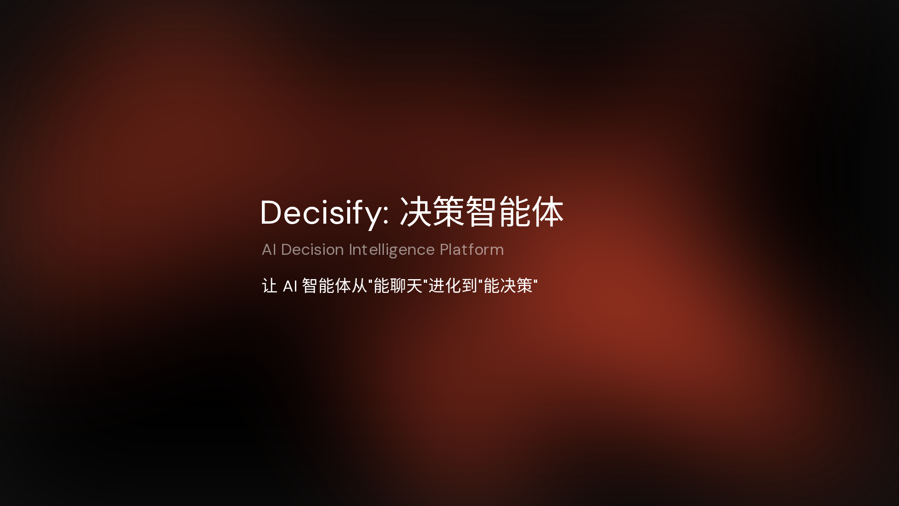

# Slidev Templates

[](https://github.com/iridite/slidev-templates/actions/workflows/ci.yml)
[](./LICENSE)
[](./registry/templates.json)

**A curated, machine-readable registry and community collection of reusable [Slidev](https://sli.dev) presentation templates.**

The goal is not to maintain one theme. The goal is to make high-quality Slidev templates easier to **discover, evaluate, reuse, and contribute** through a consistent open-source workflow.

[中文说明](./README.zh-CN.md) · [Browse registry](./registry/templates.json) · [Submit a template](https://github.com/iridite/slidev-templates/issues/new?template=template_submission.yml) · [Contributing](./CONTRIBUTING.md) · [Governance](./GOVERNANCE.md)

## What counts as a template?

A template is a reusable starting point for a presentation, not just a visual theme. It may include a Slidev theme, starter deck, layouts, components, configuration, examples, documentation, export/deployment workflows, and recommended project structure.

This registry therefore complements Slidev's theme ecosystem rather than duplicating it: **themes provide appearance; templates provide a complete starting workflow.**

## Template catalog

<!-- registry-catalog:start -->
| Template | Status | Source | Highlights | Start |
| --- | --- | --- | --- | --- |
| [Neko Style](./neko-style/) | ✅ Verified | Hosted | `technical`, `developer`, `dark`, `ai`, `conference` | <code>npx degit iridite/slidev-templates/neko-style my-presentation</code> |
| [LittleSound Talks Template](https://github.com/LittleSound/talks-template) | 🟦 Community | External | `developer`, `multi-talk`, `pnpm`, `vue`, `workspace` | <code>npx degit LittleSound/talks-template my-talks</code> |
| [Espressif Slidev Template](https://github.com/espressif/slidev-esp-template) | 🟦 Community | External | `corporate`, `developer`, `technical`, `branded`, `addons` | <code>npx degit espressif/slidev-esp-template my-presentation</code> |
| [Miragon Slidev Deck Template](https://github.com/Miragon/slidev-deck-template) | 🟦 Community | External | `corporate`, `scaffolder`, `automation`, `ai`, `validation` | <code>npm create @miragon/slidev-deck@latest my-talk</code> |
| [Presentations Template](https://github.com/askpt/presentations.template) | 🟦 Community | External | `developer`, `typescript`, `deployment`, `multi-theme`, `devcontainer` | <code>npx degit askpt/presentations.template my-presentation</code> |
| [3mdeb Slidev Template](https://github.com/3mdeb/slidev-template) | 🟦 Community | External | `technical`, `automation`, `testing`, `visual-regression`, `production` | <code>git submodule add https://github.com/3mdeb/slidev-template.git slidev-template</code> |
| [Slidev Resources Template](https://github.com/kaakaa/slidev-resources-template) | 🟦 Community | External | `multi-talk`, `github-pages`, `pdf`, `automation`, `release` | <code>gh repo create my-slides --template kaakaa/slidev-resources-template --public</code> |
| [Godkun PPT Template](https://github.com/godkun/ppt-template) | 🟦 Community | External | `developer`, `pnpm`, `visual`, `starter`, `custom-style` | <code>git clone https://github.com/godkun/ppt-template.git</code> |
<!-- registry-catalog:end -->

This table is generated from [`registry/templates.json`](./registry/templates.json), so the human-facing catalog and the machine-readable registry cannot silently drift apart.

The registry deliberately mixes repository-hosted templates and independently maintained external projects. External authors keep ownership and governance of their projects; this repository only provides curated discovery metadata.

### Neko Style preview

[](./neko-style/)

Neko Style is the first reference implementation in the registry. It includes a ready-to-run starter, reusable layouts and components, documentation, preview assets, and automated build/export verification.

## A registry, not just a list

[`registry/templates.json`](./registry/templates.json) is the canonical machine-readable catalog. Entries use a documented schema and are validated by CI.

The registry supports two contribution models:

- **Hosted templates** live in this repository and can be continuously tested here.
- **External templates** stay in their canonical upstream repository and are indexed here for discovery without vendoring somebody else's project.

See [`registry/README.md`](./registry/README.md) for the data model, review statuses, and acceptance criteria.

### Verification status

- **Verified** — maintainers have reviewed the entry and validated its documented usage path.
- **Community** — accepted into the catalog with sufficient documentation and licensing, but not continuously tested here.
- **Experimental** — useful early-stage work with weaker compatibility guarantees.

Status describes verification, not popularity.

## Submit a template

We actively welcome reusable Slidev templates from the community.

The easiest route is the **Template submission** issue form. Provide the canonical source, preview, license, tags, and the shortest reproducible way for a new user to start from it. Maintainers can then recommend either an external registry entry or a hosted contribution.

A strong submission should have:

1. a clear README or usage guide;
2. a reproducible start/copy workflow;
3. at least one representative preview or live demo;
4. explicit licensing and attribution;
5. an identifiable maintainer or canonical source;
6. enough structure to be useful beyond one specific talk.

We curate for usefulness and maintainability rather than maximizing the number of entries.

## For contributors and maintainers

```bash
git clone https://github.com/iridite/slidev-templates.git
cd slidev-templates
npm ci
npm test
```

`npm test` validates both hosted-template regression tests and registry integrity. Hosted template changes can add their own build/export checks as the catalog grows.

For the current Neko Style reference template:

```bash
npm run dev:neko
npm run build:neko
npm run export:neko
```

GitHub Actions runs tests, builds the hosted reference template, and verifies PDF export on pushes and pull requests. A separate Registry Health workflow checks external canonical sources and preview links on registry changes and on a weekly schedule.

## Repository structure

```text
slidev-templates/
├── registry/
│   ├── templates.json      # canonical template catalog
│   ├── schema.json         # registry schema
│   └── README.md           # registry rules and status model
├── scripts/                # catalog generation + upstream health checks
├── tests/                  # registry + hosted-template validation
├── .github/
│   └── ISSUE_TEMPLATE/     # bug, feature, and template submissions
├── neko-style/             # first hosted/reference template
├── assets/                 # catalog preview assets
├── CONTRIBUTING.md
├── GOVERNANCE.md
├── SECURITY.md
└── CHANGELOG.md
```

## Project direction

The project is building toward a useful community discovery layer rather than a single-template repository: more independently maintained templates, richer searchable metadata, compatibility signals, automated health checks, and eventually a browsable gallery generated from the same registry data.

The registry format is intentionally machine-readable so other tools, agents, sites, and Slidev workflows can consume it without scraping README files.

## Governance

Issues and pull requests are triaged for reproducibility, user impact, ecosystem usefulness, licensing, and maintenance cost. Registry additions are reviewed rather than automatically accepted. The current primary maintainer and decision process are documented in [`GOVERNANCE.md`](./GOVERNANCE.md).

Read [`CONTRIBUTING.md`](./CONTRIBUTING.md) before submitting changes. Security issues should be reported according to [`SECURITY.md`](./SECURITY.md).

## License

Repository-maintained code and documentation are available under the [MIT License](./LICENSE). External registry entries retain their own upstream licenses, which are recorded in the catalog.
