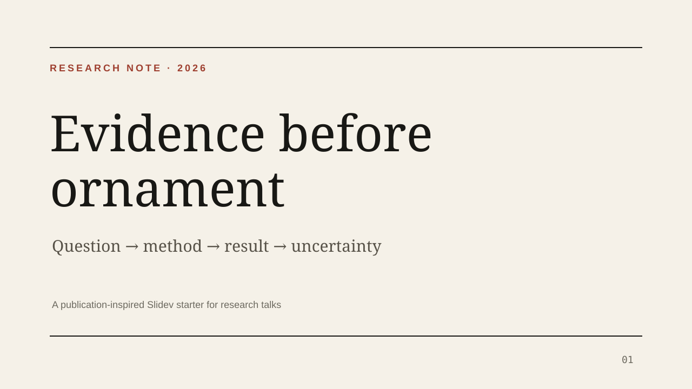
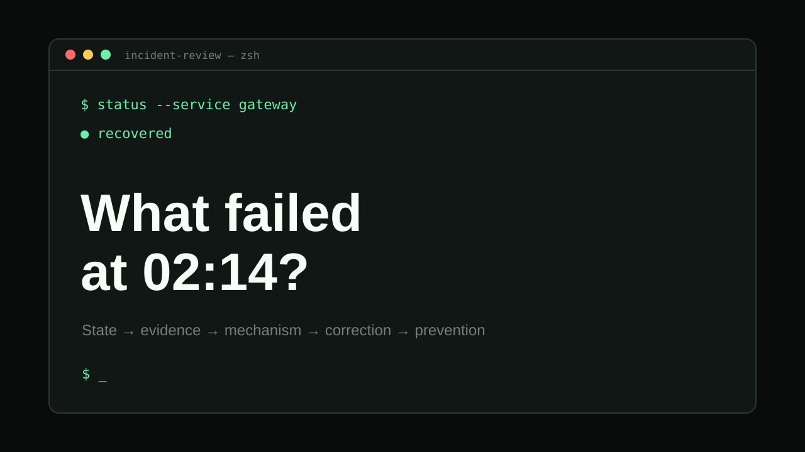

# Slidev Templates

[](https://github.com/iridite/slidev-templates/actions/workflows/ci.yml)
[](https://github.com/iridite/slidev-templates/actions/workflows/registry-health.yml)
[](https://github.com/iridite/slidev-templates/stargazers)
[](https://github.com/iridite/slidev-templates/forks)
[](./LICENSE)
[](./registry/templates.json)

这是一个面向 [Slidev](https://sli.dev) 的**高质量模板收录、发现、验证与社区协作生态**，而不是只维护某一个主题，也不是未经审核的链接列表。

这里的「模板」指一套完整、可复用的演示起点：Starter、叙事结构、布局或组件、配置、文档、预览，以及可复现的构建或交付路径。Theme 可以是模板的一部分，但不是本项目的收录边界。

[English](./README.md) · [Registry JSON](./registry/templates.json) · [Gallery](./gallery/README.md) · [模板契约](./docs/TEMPLATE_CONTRACT.md) · [提交模板](https://github.com/iridite/slidev-templates/issues/new?template=template_submission.yml) · [治理规则](./GOVERNANCE.md)

<!-- registry-stats-zh:start -->
**12 个经过筛选的工作流 · 4 个仓库托管模板 · 8 个上游治理条目 · 4 个已验证条目**
<!-- registry-stats-zh:end -->

## 为什么需要这个项目

优秀的 Slidev Starter 分散在个人、学校和组织仓库中。用户很难快速比较它们的用途、许可证、启动方式、维护状态和实际验证深度。Slidev 已经拥有成熟的 Theme 生态；本项目补充的是更广泛的 **Template 级发现与维护层**。

仓库也已经产生真实的社区维护信号：外部贡献者曾通过 [PR #6](https://github.com/iridite/slidev-templates/pull/6) 发现并修复独立安装问题，规范问题也通过 [Issue #7](https://github.com/iridite/slidev-templates/issues/7) 进入分诊与修复流程。现在这些互动已经由结构化提交、回归测试、清洁构建、来源规则和定时健康检查承接。

## 本仓库托管的模板

目前有四个由本仓库维护的模板。下面三个遵循新 Template Contract，全部是 clean-room 原创实现，并可直接提取成自包含项目。

<table>
  <tr>
    <td width="33%"><a href="./templates/paper-lab/"></a></td>
    <td width="33%"><a href="./templates/terminal-ink/"></a></td>
    <td width="33%"><a href="./templates/editorial-grid/"></a></td>
  </tr>
  <tr>
    <td><b>Paper Lab</b><br/>研究问题、方法、结果、不确定性与局限。</td>
    <td><b>Terminal Ink</b><br/>故障复盘、日志、系统机制、修复与运行决策。</td>
    <td><b>Editorial Grid</b><br/>产品叙事、战略、发布和证据驱动的故事表达。</td>
  </tr>
</table>

[Neko Style](./neko-style/) 保留为历史兼容路径下的大型参考实现，包含可复用 Theme、组件库、Starter、文档、构建检查和 PDF 导出验证。

## 完整目录

下表由 [`registry/templates.json`](./registry/templates.json) 自动生成。中英文 README 只要与 Registry 漂移，CI 就会失败。

<!-- registry-catalog-zh:start -->
| 模板 | 状态 | 来源 | 定位 | 验证 | 快速开始 |
| --- | --- | --- | --- | --- | --- |
| [Neko Style](./neko-style/) | ✅ 已验证 | 本仓库托管 | `developer`, `technical`, `conference` | build and export | <code>npx degit iridite/slidev-templates/neko-style my-presentation</code> |
| [Paper Lab](./templates/paper-lab/) | ✅ 已验证 | 本仓库托管 | `academic`, `research`, `data-storytelling` | clean install build | <code>npx degit iridite/slidev-templates/templates/paper-lab/starter paper-lab-talk</code> |
| [Terminal Ink](./templates/terminal-ink/) | ✅ 已验证 | 本仓库托管 | `developer`, `systems`, `incident-review` | clean install build | <code>npx degit iridite/slidev-templates/templates/terminal-ink/starter terminal-talk</code> |
| [Editorial Grid](./templates/editorial-grid/) | ✅ 已验证 | 本仓库托管 | `product`, `strategy`, `storytelling` | clean install build | <code>npx degit iridite/slidev-templates/templates/editorial-grid/starter editorial-talk</code> |
| [LittleSound Talks Template](https://github.com/LittleSound/talks-template) | 🟦 社区收录 | 外部上游 | `developer`, `multi-talk`, `workspace` | metadata health | <code>npx degit LittleSound/talks-template my-talks</code> |
| [Espressif Slidev Template](https://github.com/espressif/slidev-esp-template) | 🟦 社区收录 | 外部上游 | `corporate`, `developer`, `technical` | metadata health | <code>npx degit espressif/slidev-esp-template my-presentation</code> |
| [Miragon Slidev Deck Template](https://github.com/Miragon/slidev-deck-template) | 🟦 社区收录 | 外部上游 | `corporate`, `automation`, `design-system` | metadata health | <code>npm create @miragon/slidev-deck@latest my-talk</code> |
| [Presentations Template](https://github.com/askpt/presentations.template) | 🟦 社区收录 | 外部上游 | `developer`, `deployment`, `multi-theme` | metadata health | <code>npx degit askpt/presentations.template my-presentation</code> |
| [3mdeb Slidev Template](https://github.com/3mdeb/slidev-template) | 🟦 社区收录 | 外部上游 | `technical`, `testing`, `automation` | metadata health | <code>git submodule add https://github.com/3mdeb/slidev-template.git slidev-template</code> |
| [Slidev Resources Template](https://github.com/kaakaa/slidev-resources-template) | 🟦 社区收录 | 外部上游 | `multi-talk`, `automation`, `publishing` | metadata health | <code>gh repo create my-slides --template kaakaa/slidev-resources-template --public</code> |
| [Godkun PPT Template](https://github.com/godkun/ppt-template) | 🟦 社区收录 | 外部上游 | `developer`, `visual`, `fast-start` | metadata health | <code>git clone https://github.com/godkun/ppt-template.git</code> |
| [NJU Academic Slidev Template](https://github.com/sylearn/nju-slidev-template) | 🧪 实验性 | 外部上游 | `academic`, `research`, `chinese` | metadata health | <code>npx degit sylearn/nju-slidev-template academic-talk</code> |
<!-- registry-catalog-zh:end -->

外部条目继续由其上游作者负责所有权、许可证、发布和治理。本项目只维护发现与健康证据，不会重新授权，也不会把外部代码描述成本仓库资产。

## 浏览、搜索与提取

本地启动 Gallery：

```bash
git clone https://github.com/iridite/slidev-templates.git
cd slidev-templates
npm run gallery:serve
```

打开 `http://127.0.0.1:4173/gallery/`。Gallery 支持按文本、分类、来源、状态和验证级别筛选，显示许可证证据，并可复制规范化启动命令。`npm run gallery:build` 会生成可部署的静态产物；发布仍通过显式的 Maintainer Pages 工作流执行。

Registry CLI：

```bash
npm run templates -- list
npm run templates -- search academic
npm run templates -- info terminal-ink
npm run templates -- scaffold editorial-grid ./my-talk
```

CLI 会为外部项目返回 canonical command；提取本仓库模板时，会连同 README、LICENSE 和 ATTRIBUTION 一起保留。

## 机器可读契约

网站、CLI、AI Agent 和其他工具可以直接消费：

- [`registry/templates.json`](./registry/templates.json)：版本化 canonical catalog；
- [`registry/schema.json`](./registry/schema.json)：与真实字段一致的 JSON Schema；
- [`registry/hosted-template.schema.json`](./registry/hosted-template.schema.json)：Hosted Manifest 契约；
- [`registry/FIELDS.md`](./registry/FIELDS.md)：字段语义与演进规则。

Registry v2 记录模板类型、分类、所有权边界、直接许可证证据、预览、启动命令、来源、已验证兼容性、验证级别、验证项目、工作流路径和复核日期。

## 验证与健康模型

每个 Pull Request 都会分别执行：

1. Registry 与 Schema 一致性、许可证证据、Manifest、CLI、自动生成目录、Gallery 构建和回归测试；
2. 所有新式 Hosted Starter 的清洁安装与 Slidev Build；
3. Neko Style 的 Build 和 PDF Export。

独立的定时工作流会检查外部 canonical repository、预览 URL 和 license URL。缺失或被禁用的来源会导致失败；长期无更新或 archived 的项目会产生明确警告，而不是被静默展示为健康。

状态只表达证据深度：

- **Verified**：主要使用路径已经执行，Hosted 条目持续接受本仓库 CI；
- **Community**：来源、预览、许可证和发现信息持续检查，运行时验证留在上游；
- **Experimental**：具有独特价值，但兼容性或品牌使用边界更弱。

状态不等于热度排名，也不代表本项目背书。

## 收录、来源和人工决策

Hosted 与 External 模式严格分开：

- 本仓库原创实现可以托管并持续构建；
- 许可证允许的改编必须明确来源并保留 Notice；
- 互惠许可证、品牌化或已有独立治理的项目默认仅做 External 收录；
- 仓库公开但没有许可证，不代表允许复制。

公开项目调研和收录判断见 [`docs/TEMPLATE_LANDSCAPE.md`](./docs/TEMPLATE_LANDSCAPE.md)，可复用标准见 [`docs/TEMPLATE_CONTRACT.md`](./docs/TEMPLATE_CONTRACT.md)。

自动化和 Coding Agent 可以辅助候选发现、元数据提取、清洁环境复现、测试、Issue 分诊、Review 准备、Catalog/Gallery 生成和失效检测；但收录、许可证、商标与来源判断、安全、合并、移除和发布必须由人类 Maintainer 最终决定。详见 [`docs/AI_ASSISTED_MAINTENANCE.md`](./docs/AI_ASSISTED_MAINTENANCE.md)。

## 提交模板

使用 [Template Submission Form](https://github.com/iridite/slidev-templates/issues/new?template=template_submission.yml)，需要提供：

- canonical source 与维护者；
- 代表性预览或 live demo；
- 可复现启动方式；
- SPDX License 与直接许可证链接；
- 来源和第三方资产说明；
- 目标受众、演示任务及独特价值；
- 实际执行过的验证环境和命令。

项目追求有用、独特、可信和可维护，而不是单纯追求条目数量。

## 开发与验收

```bash
git clone https://github.com/iridite/slidev-templates.git
cd slidev-templates
npm ci
npm run registry:catalog:check
npm run gallery:check
npm test
npm run build:hosted
npm run build:neko
```

涉及 Neko Style 渲染或导出时：

```bash
npm run export:neko
```

## 项目方向

下一阶段重点是 adoption，而不是无差别扩充：发布稳定 Gallery、增强兼容性探针和健康快照、接纳高质量作者提交、方便下游工具消费版本化 Registry，并与被收录项目的上游维护者建立反馈闭环。

具体见 [`ROADMAP.md`](./ROADMAP.md)。

## License

本仓库维护的代码和文档采用 [MIT License](./LICENSE)，除非子目录另有说明。External 条目保留其上游许可证；进入 Registry 不会改变任何外部项目的授权。
